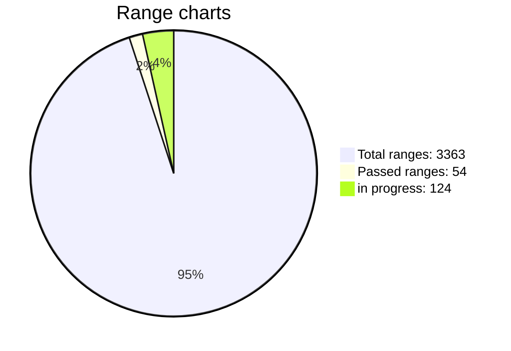

# Challenge WIF 500
 </br>
**Find the key, get 100 BTC donations!**</br>

Run ```wif500.exe -range 1``` (0-3363)

The known part of the key is 40 characters from 52</br>
A large range of 12 characters is divided into 3364 small ranges</br>
The address [1PfNh5fRcE9JKDmicD2Rh3pexGwce1LqyU](https://www.blockchain.com/btc/address/1PfNh5fRcE9JKDmicD2Rh3pexGwce1LqyU)</br>
If you have a GPU and are ready to search for a key 24/7</br>

How to participate in the hunt for the key:</br>
Add a telegram [**GPU group**](https://t.me/+WFEuFatijpowMjRi) </br>
Write: the numbers of the range in which you took for the search.</br>
Do not take busy ranges, see the table.</br>
I mark them in the [**table hunters**](https://github.com/phrutis/wif500#numbers-of-ranges-0-3363) as in progress.</br>

When you have a range progress of more than 90% (100%) take a screenshot and post it in the group. </br>
I will (check) and mark the range as passed, assign it to you.</br>

If the key is found:</br>
In addition to the main donation of 100 BTC to the finder.</br>
There will be a small compensation of 3.364 btc to all hunters at 0.001 btc ($41) for each range they cover.</br> 
This should offset the cost of electricity and more.</br>
Do not try to draw screenshots, search honestly.</br>

If the key is found earlier, the amount of 3.364 BTC will be divided into hunters with passed ranges.</br>
Example.
A total of 1000 ranges have been completed and the key has been found.</br>
3.364 btc / 1000 = 0.00364 per completed range.</br>

### Frequently asked Questions:

WIF real?</br>
To find out, you need to go through a large range and find out.</br>
This requires large GPU resources.</br>

Why is the program without source codes?</br>
The correct ranges and other parameters are sewn into the WifSolverCuda program.</br>
Knowing them, the user can find the key on his own and take everything for himself.</br>

Why did you paint over the characters in the photo?</br>
So that the user does not look for the key on the original program.</br>

Does the program require an internet connection?</br>
No, the program is looking for the key offline.</br>

If I find the key can I take all the coins for myself?</br>
No, you will find the encrypted key.</br>
Only the organizers of the challenge can decrypt this key and pay you a donation.</br>

There is a video in which there is a similar key.</br>
There are errors in the video that make the key impossible to find.</br>

I have many GPUs. How to start?</br>
Run each GPU separately with a new range Add your card id -d ?</br>
Example:</br>
```wif500.exe -range 1000 -d 0```</br>
```wif500.exe -range 1001 -d 1```</br>
```wif500.exe -range 1002 -d 2```</br>

For RTX 3060, 3070, 3080, 3090 cards use:</br>
```wif500-RTX30xx.exe -range 444 -d 0```</br>
```wif500-RTX30xx.exe -range 445 -d 1```</br>
```wif500-RTX30xx.exe -range 446 -d 2```</br>

How long can you go through the range?</br>
RTX 3090 4 Gkey/s = ~4 days.</br>
RTX 3060 2 Gkey/s = ~8 days.</br>


## Numbers of ranges 0-3363


| Ranges      | Hunter    | Status         |
|:------------|-----------|----------------|
| 123        | Gia Go    |  in progress :hammer:  |
| 215        | bet more  |  in progress :hammer:  |
| 219        | bet more  |  in progress :hammer:  |
| 420-427    | bet more  |  in progress :hammer:  |
| 555        | OG 674    |  in progress :hammer:  |
| 666        | bet more  |  in progress :hammer:  |
| 777        | JRodary   |  in progress :hammer:  |
| 918        | Haymac    |  in progress :hammer:  |
| 1111       | Kuw       |  in progress :hammer:  |
| 1123-1152  | Jason     |  in progress :hammer:  |
| 1210-1268  | Zebra     |  in progress :hammer:  |
| 1401       | Kuw       |  in progress :hammer:  |
| 1502       | Kuw       |  in progress :hammer:  |
| 1512       | bet more  |  in progress :hammer:  |
| 1600       | Haymac    |  in progress :hammer:  |
| 1610-1618  | Noname    |  in progress :hammer:  |
| 1619-1672  | Noname    |  Passed :heavy_check_mark:  |
| 1725       | bet more  |  in progress :hammer:  |
| 2020       | Leonid    |  in progress :hammer:  |
| 2022       | Leonid    |  in progress :hammer:  |
| 2581       | snaiper   |  in progress :hammer:  |
| 2700       | Alexander |  in progress :hammer:  |
| 2911       | bet more  |  in progress :hammer:  |
| 3001       | bet more  |  in progress :hammer:  |
| 3021       | Kripto    |  in progress :hammer:  |
| 3363       | bet more  |  in progress :hammer:  |




